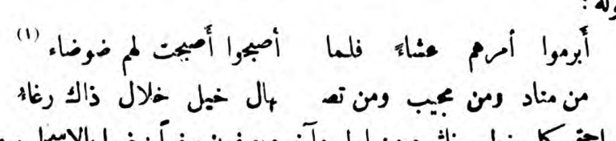

# Issues to be solved
## Serialised articles

While the technical linking by means of attributes is simple, how should the human-readable information contained in the print copies be encoded?

I suggest encoding this information with `<ref>` or an XPointer.

## Typographic marks

Early-twentieth century periodicals contain a lot of typographic markers indicating foreign words, technical terms, proper names, and the end of a section.

### section dividers

The pages contain a large number of different graphic dividers. Sometimes they indicate the end or the beginning of a sections. Sometimes they are followed by a new headline, sometimes they are not. In order not to infer too much from these visual dividers and as they were not transcribed by *shamela.ws*, I have decided to encode them as "anonymous blocks": `<ab>`

Most of these blocks are centered and thus they carry a `@rend="centered"` attribute, which, at a later stage could be used to be automatically translated into a formal `@rendition` statement.

# Gaps in the transcription

Gaps in the transcription as copied from *shamela.ws* are marked as `<gap resp="#org_MS" unit="pages" quantity="1"/>`. Many, if not most of these originated as the gap between two halves of a single line of a *qaṣīda*.

Sometimes shamela's transcribers could not read a word and marked such omissions with ellipses:

> مثل ال. . . . . ود لكن درها عسل

# Structure

Each issue is conceived of as a single `<text>` that is then grouped into volumes and a complete edition of all issues by means of xPointer.

## The periodical issue

The main structural unit are `
`s, as usual.

~~~{.xml}
<text type="issue">
    <front>
    <!-- some bibliographic data commonly found in the masthead -->
    </front>
    <body>
        

            <head></head>
            

            <!-- ... -->
        

        

            <head></head>
            

            <head></head>
            

            <!-- ... -->
        

        

    </body>
</text>
~~~

The bibliographic meta-data in the `<front>` is not necessarily found in the issue itself, since, according to Seikaly, issues carried no date whatsoever after Ramadan 1327 / September 1909.^["*al-Muqtabas* appeared regularly at the beginning of every Arab month only when it was published in Cairo (between *Muharram* 1324 / Februrary 1906 and *Dhul-hijja* 1909). When it was removed to Damascus and because of frequent official harassment, it appeared irregularly and somewhat haphazardly. Although after 1909, as indeed before it, each volume contained twelve numbers, nevertheless publication of each separate issue did not necessarily occur on time at the start of every month of the Muslim calendar. Indeed the last issue to which a specific month was affixed was *Ramadan* 1327 / September 1909. After that Kurd 'Ali merely numbered his journal by year, volume and issue. Because of this feature reference to *al-Muqtabas* in this study will throughout follow its owner's method of enumeration." {Seikaly 1981@126}] Unfortunately Seikaly's statement is caused by the absence of the cover sheets from most surviving copies and collections of *al-Muqtabas*. The copy of volume 4 from the holdings of OIB show that the cover sheet / wrapper still carried a date after Ramadan 1327: issue 12 was published for Dhū al-Ḥujja 1327 

##  Divisions: `
`

Divisions can be of various types (`@type`), using a semi-controlled vocabulary of attribute values

- structual information
    + `section`
    + `article` (?)
- genre information
    - `advert`
    - `article`
    - `bill`

<!-- needs revisions -->
As paragraphs (`
`) cannot interlace with `
`s after the first `
` child of a parent `
`, `
` is commonly the lowest level of tessellation but in the case of very long articles that might themselves contain `@type="section"` children.

The common structure of an issue would be a mix of `
` and `
`

### heads

Sections and articles are commonly introduced by a clearly distinguishable heading. These are marked-up as `<head>`. Some articles might also have sub headings, which should be marked up as `<head type="sub">`. 

See for example [i_50](xml/oclc_4770057679-i_50.TEIP5.xml#div_5.d1e2312):

~~~{.xml}

    <head>الاتكال الشرقي</head>
    <head type="sub">نصيحة غربي</head>
    

        <!-- -->
    

~~~

Beware that what looks like a sub heading, might also be a section heading introducing a sub section of an article.

### legal texts, bills

It is quite common to find legal texts in late nineteenth, early twentieth century periodicals and I would like to differenciate them by means of the `@type="bill"` attribute because they can be nested inside an article or appear as free-standing chunk of text on the article level. Legal texts are commonly structured into sections / chapters, articles, and paragraphs and shall be encoded thus; i.e. as `
`, `
`, and `
`.

This encoding however mixes structural `@type` attributes such as `section` and `article` with semantic assumptions as to the genre of the text, i.e. `bill`. In future iterations of the schema / encoding this should be tackled and changed.

In some cases the legal text itself is accompanied by a commentary intersecting with the legal text on the article level. they could be encoded in various ways, but the important thing is to link the commentary to the corresponding article by means of an attribute.

## Page, line, and column breaks

Currently, only page breaks are recorded. They are marked up with the empty milestone element `<pb/>`. Page breaks found in *al-maktaba al-shāmila*, however, do not correspond to those in the original printed copies. They were therefore marked as `<pb ed="shamila">`. Page breaks corresponding to the original printed edition are identified by `@ed="print"`.

Dār Ṣādir in Beirut published a reprint in 1992, which is entirely unmarked as such but for the information on the binding itself. Checking this reprint against the original, it appeared to be a facsimile reprint: pagination, font, layout --- everything is identical.

1. Printed original copy: `<pb ed="print"/>`
    - the page number is recorded in the `@n` attribute
    - These page breaks are then linked through the `@facs` attribute to the `@xml:id` of a `<surface>` element; i.e. `<pb ed="print" n="78" facs="#facs_78"/>`
2. Transcription from *al-maktaba al-shāmila*: `<pb ed="shamela"/>`

The current state of mark-up for page breaks is kept in a [second file](notes-tei-markup-pb.md).

## Lists

Lists have been encoded as `<list>` independent of their original formating (only rarely were lists indented etc.). In case lists apear with numbered labels in the original, i.e. "(الخامس)", "(٢)", the labels have been encoded with `<label>`.

## Notes

Unfortunately, *al-maktaba al-shāmila* did NOT include the sometimes abundant footnotes in their transcription.

Notes should be encoded with `<note>` at the location it appears in the text. The super-scripted number is recorded in the `@n` attribute. A further `@type="footnote"` attribute specifies that this note appeared in the actual print edition, as opposed to potential editorial notes added by various editors of the digital edition, which should carry `@type="editorial"` and a `@resp` attribute pointing to the responsible editor. 

## Tables

## Verse

Many articles contain *qaṣīda*s with the characteristic printing of the two *bayt*s on each line as two columns. After some talk with Mathew Miller from the Persian Digital Library and their TEI files of Persian poetry, I decided to follow their encoding of *bayt* as `<l type="bayt">` with two `<seg>` children. Successive lines are then wrapped in `<lg>`:

~~~ {.xml}
<lg>
    <l type="bayt">
        <seg>أبرموا أمرهم عشاء فلما </seg> <seg>أصبحوا أصبحت لهم ضوضاء</seg>
    </l>
    <l type="bayt">
        <seg>من منادٍ ومن مجيبٍ ومن تص</seg><seg>هالٍ خليل خلال ذاك رغاء</seg>
    </l>
</lg>
~~~

There are cases when words are split between the two lines of the *qaṣīda*:

How should this be encoded?

~~~ {.xml}
<l type="bayt">
    <seg>أبرموا أمرهم عشاء فلما </seg>
    <seg> أصبحوا أصبحت لهم ضوضاء</seg>
</l>
<l type="bayt">
    <seg>من منادٍ ومن مجيبٍ ومن تص</seg>
    <seg>هالٍ خليل خلال ذاك رغاء</seg>
</l>
~~~

# Punctuation

There are two problems with punctuation in this corpus:

1. The original prints show an inconsistent use of punctuation marks
    - the many quotes are sometimes wrapped in quotation marks, sometimes in brackets, but mostly they are not typographically marked
    - many quotes are preceded by a leading colon.
    - words in foreign languages are sometimes wrapped in quotation marks or brackets.
2. The *shamela.ws* transcribers inconsistently transcribed existing punctuation marks and added some of their own, particularly full stops. 

## encoding in TEI

Punctuation marks are not consistently transcribed into TEI in consequence. I have chosen to retain all existing punctuation from *shamela.ws*. In some cases I have added encoding for quotation marks and quotations:

1. `<q>`: material visually marked by some sort of quotation marks, but which not necessarily constitute a quotation
2. `<quote>`: a phrase or passage attributed by the narrator or author to some agency external to the text.

# URIs

each part of the edition down to, at least, the paragraph level should be addressable for reference in scholarly work with stable `@xml:id`s

1. General principle: The URI should resemble a sequence of key-value pairs
    + key and value are deliminated by `_`
    + key-value pairs are deliminate dy `-`
1. File names:
    + I decided to start with an existing identifier for *al-Muqtabas*, the OCLC number: `oclc_4770057679`, and
    + a continuous issue counter from 1 to 96: `oclc_4770057679-i_60`
    + Volumes run from 1 to 9: `oclc_4770057679-v_6`
3. Elements inside the files:
    + Make use of `@xml:base` on the `<tei:TEI>` allows for shorter internal `@xml:id`s
    + facsimiles: they are simply identified by combining a short string signifying facsimiles (i.e. "facs_") with the image number provided by HathiTrust. `facs_93` thus identifies a `<surface>` element with `<graphic>` children pointing to different file formats and locations.
    + graphics: `facs_93-g_1`
    + all other elements:
        * combine the element's name as key with the position of the element in the document tree and an automatically generated ID (through XPath function `generate-id()`) separated by a period: `div_12.d1e1895`
        * note that the first number after the underscore cannot and should be used to identify the position of an element in the tree, as these will most certainly change over time, while the `@xml:id` shall be stable.
        * the process of assigning IDs is automated through the XSLT [`Tei-GenerateIds.xsl`](xslt/Tei-GenerateIds.xsl) and it needs to be run everytime someone has added mark-up to the file.

<!-- + page breaks: the print edition is paginated per volume. It would thus make much sense to adopt a similar URI-scheme for `<pb>`s, for instance, `<pb xml:id="pb_176" n="176"/>` -->

# Facsimiles

Image files are available from the [*al-Aqṣā* Mosque's library in Jerusalem through the British Library's "Endangered Archives Project" (vols. 2-7)](http://eap.bl.uk/database/overview_project.a4d?projID=EAP119;r=63), [HathiTrust (vols. 1-6, 8)](http://catalog.hathitrust.org/Record/100658549), and [Institut du Monde Arabe](http://ima.bibalex.org/IMA/presentation/periodic/list.jsf?pid=9C82C139F9785E99D30089727B40A269). Due to its open access licence, preference is given to facsimiles from EAP.

## EAP119

- links to volumes:
    + [Vol. 2](http://eap.bl.uk/database/overview_item.a4d?catId=809;r=12316)
    + [Vol. 3](http://eap.bl.uk/database/overview_item.a4d?catId=812;r=3035)
    + [Vol. 4](http://eap.bl.uk/database/overview_item.a4d?catId=813;r=22190)
    + [Vol. 5](http://eap.bl.uk/database/overview_item.a4d?catId=814;r=1842)
    + [Vol. 6](http://eap.bl.uk/database/overview_item.a4d?catId=810;r=288)
    + [Vol. 7](http://eap.bl.uk/database/overview_item.a4d?catId=811;r=30106)
- access:
    + the journal is in the public domain and the images can be freely accessed without restrictions. EAP does not provide a download button.
    + Terms of access for material provided by the British Library can be found [here](http://www.bl.uk/aboutus/terms/index.html)

##  HathiTrust

- links to volumes
    + [Vol. 1](http://hdl.handle.net/2027/umn.319510029968608)
    + [Vol. 2](http://hdl.handle.net/2027/umn.319510029968616)
    + [Vol. 3](http://hdl.handle.net/2027/umn.319510029968624)
    + [Vol. 4](http://hdl.handle.net/2027/umn.319510029968632)
    + [Vol. 5](http://hdl.handle.net/2027/umn.319510029968640)
    + [Vol. 6](http://hdl.handle.net/2027/njp.32101073250910)
    + [Vol. 8](http://hdl.handle.net/2027/njp.32101007615691)
    + [Index](http://hdl.handle.net/2027/umn.31951d008457474)
- access
    + The journal is in the public domain in the US and can be freely accessed and downloaded
    + Outside the US, access is restricted.
    + Formal [licence](https://www.hathitrust.org/access_use#pd-us-google): 

> Public Domain or Public Domain in the United States, Google-digitized: In addition to the terms for works that are in the Public Domain or in the Public Domain in the United States above, the following statement applies: The digital images and OCR of this work were produced by Google, Inc. (indicated by a watermark on each page in the PageTurner). Google requests that the images and OCR not be re-hosted, redistributed or used commercially. The images are provided for educational, scholarly, non-commercial purposes.
> Note: There are no restrictions on use of text transcribed from the images, or paraphrased or translated using the images.

## Mark-up

Facsimiles are linked through the `<facsimile>` child of `<TEI>`:

~~~{.xml}
<facsimile>
    <surface xml:id="facs_445">
        <graphic xml:id="facs_445-g_1" url="../images/oclc-4770057679_v6/njp-32101073250910_img-445.tif" mimeType="image/tiff"/>
        <graphic xml:id="facs_445-g_2" url="../images/oclc-4770057679_v6/njp-32101073250910_img-445.jpg" mimeType="image/jpeg"/>
        <graphic xml:id="facs_445-g_3" url="http://babel.hathitrust.org/cgi/imgsrv/image?id=njp.32101073250910;seq=445" mimeType="image/jpeg"/>
        <graphic xml:id="facs_445-g_4" url="http://eap.bl.uk/EAPDigitalItems/EAP119/EAP119_1_4_5-EAP119_muq191108_441_L.jpg" mimeType="image/jpeg"/>
    </surface>
</facsimile>
~~~

- The `@url` of `<graphic>` links to local downloads of the image as well as to the image hosted on HathiTrust's servers

# Metadata

## bibliographic information

All bibliographic information pertaining to the file and the individual periodical issue should be encoded in a `<biblStruct>`

1. In the `<teiHeader>` information should be provided in Latin script
2. In the `<front>` information should be provided in Arabic, just as it would in the masthead of the actual issue

### volume

### issue

All information on the individual issue is part of the *monographic* level of bibliographic metadata. Journals and anthologies are treated as monographs (`<monogr>`). The structure is as follows:

1. title and subtitle:
    - `<title level="j">` indicates a journal title
    - `<title level="j" type="sub">` indicates the subtitle
2. authors, editors, other persons in some way responsible for the content
    - `<editor>`
4. imprint: `<imprint>`
    1. place of publication: `<pubPlace>`
    2. publisher: `<publisher>`
    3. date of publication: `<date>`
5. scope of item (volume, issue, pages)
    - `<biblScope>` with `@unit` attribute of "volume", "issue", "pages" and `@n`, `@from`, `@to` indicating the actual extent. The element should have no `text()` content to avoid language-specificity

Current structure of the `<biblStruct>` in `<sourceDesc>`:

~~~{.xml}
<teiHeader>
<!-- ... -->
<biblStruct>
    <monogr>
        <title level="j" xml:lang="ar">المقتبس</title>
        <title level="j" type="sub" xml:lang="ar">مجلة تبحث في التربية والتعليم والاجتماع والاقتصاد والاداب والتاريخ والآثار واللغة و تدبير المنزل والصحة والكتب وحضارة العرب والغرب</title>
        <title level="j" type="sub" xml:lang="ar">تصدر في كل شهر عربي بدمشق</title>
        <title level="j" xml:lang="ar-Latn-x-ijmes">[Majallat] al-Muqtabas</title>
        <title level="j" type="sub" xml:lang="ar-Latn-x-ijmes">Majalla tabḥath fī al-tarbiyya wa-l-taʿlīm wa-l-ijtimāʿ wa-l-iqtiṣād wa-l-adab wa-l-tārīkh wa-l-āthār wa-l-llugha wa tadbīr al-manzil wa-l-ṣaḥḥa wa-l-kutub wa ḥaḍāra al-ʿarab wa ḥadāra al-gharb</title>
        <title level="j" type="sub" xml:lang="ar-Latn-x-ijmes">tuṣadir fī kull shar ʿarabī bi-Dimashq</title>
        <title level="j" xml:lang="fr">Al-Moktabas</title>
        <title level="j" type="sub" xml:lang="fr">Revue mensuelle paraissant à Damas (Syrie)</title>
        <title level="j" type="sub" xml:lang="fr">Pédagogie, sociologie, économie politique, littérature, histoire, archéologie, philologie, ménagerie, hygiène, bibliographie, civilisation arabe et occidentale</title>
        <editor ref="https://viaf.org/viaf/32272677">
            <persName xml:lang="ar">
                <forename>محمد</forename>
                <surname>كرد علي</surname>
            </persName>
            <persName xml:lang="ar-Latn-x-ijmes" >
                <forename>Muḥammad</forename>
                <surname>Kurd ʿAlī</surname>
            </persName>
        </editor>
        <imprint>
            <publisher notAfter="1914" notBefore="1908">
                <orgName xml:lang="ar">مطبعة المقتبس</orgName>
                <orgName xml:lang="ar-Latn-x-ijmes">Maṭbaʿa al-Muqtabas</orgName>
            </publisher>
            <pubPlace notBefore="1908" notAfter="1914">
                <placeName xml:lang="ar">دمشق</placeName>
                <placeName xml:lang="en">Damascus</placeName>
            </pubPlace>
            <date xml:lang="ar" when-custom="1329-01-01" datingMethod="#cal_islamic" calendar="#cal_islamic" when="1911-01-02">١ محرم ١٣٢٩</date>
            <date xml:lang="ar-Latn-x-ijmes" when-custom="1329-01-01" datingMethod="#cal_islamic" calendar="#cal_islamic" when="1911-01-02">1 Muḥ 1329</date>
        </imprint>
        <biblScope unit="volume" n="6"/>
        <biblScope unit="issue" n="1"/>
        <biblScope unit="page" from="1" to="88"/>
    </monogr>
    <idno type="oclc">4770057679</idno>
    <idno type="oclc">79440195</idno>
    <idno type="aucr">07201136864</idno>
    <idno type="shamela">26523</idno>
</biblStruct>
<!-- ... -->
</teiHeader>
~~~

~~~{.xml}
<text>
    <front>
<!-- ... -->
<biblStruct>
    <monogr>
        <title level="j">المقتبس</title>
        <editor>محمد كرد علي</editor>
        <imprint>
            <pubPlace>دمشق</pubPlace>
            <publisher>المطبعة المقتبس</publisher>
            <date when-custom="1329-01-01" datingMethod="#cal_islamic" calendar="#cal_islamic" when="1911-01-02">١ محرم ١٣٢٩</date>
        </imprint>
        <biblScope unit="volume" n="6">المجلد السادس</biblScope>
        <biblScope unit="issue" n="1">الجزء الاول</biblScope>
        <biblScope unit="page" from="1" to="88"/>
    </monogr>
</biblStruct>
<!-- ... -->
    </front>
</text>
~~~

## Languages: `@xml:lang`

The use of language codes as values for `@xml:lang` follows [BCP 47](http://www.iana.org/assignments/language-subtag-registry/language-subtag-registry) and specifies that the language code is to be followed by information on the script, if the latter is not the common script for this language, followed by information on the transcribing convention. Use of languages is declared in the `<langUsage>` descendant of the `<teiHeader>`:

~~~{.xml}
<langUsage>
    <language ident="ar">Arabic</language>
    <language ident="ar-Latn-x-ijmes">Arabic transcribed into Latin script following the IJMES conventions</language>
    <language ident="ar-Latn-EN">Arabic transcribed into Latin script following common English practices</language>
    <language ident="ar-Latn-FR">Arabic transcribed into Latin script following common French practices</language>
    <language ident="en">English</language>
    <language ident="en-Arab-AR">English transcribed into Arabic script following common Levantine Arabic practices</language>
    <language ident="fa">Farsi</language>
    <language ident="fa-Latn-x-ijmes">Farsi transcribed into Latin script following the IJMES conventions</language>
    <language ident="fr">French</language>
    <language ident="fr-Arab-AR">French transcribed into Arabic script following common Levantine Arabic practices</language>
    <language ident="ota">Ottoman</language>
    <language ident="ota-Latn-x-ijmes">Ottoman transcribed into Latin script following the IJMES conventions</language>
    <language ident="tr">Turkish</language>
</langUsage>
~~~

These codes can then be referenced throughout the file by means of the `@xml:lang` pointing to them; e.g.

~~~{.xml}
<title level="j" xml:lang="ar">المقتبس</title>
<title level="j" type="sub" xml:lang="ar">مجلة تبحث في التربية والتعليم والاجتماع والاقتصاد والاداب والتاريخ والآثار واللغة و تدبير المنزل والصحة والكتب وحضارة العرب والغرب</title>
<title level="j" type="sub" xml:lang="ar">تصدر في كل شهر عربي بدمشق</title>
<title level="j" xml:lang="ar-Latn-x-ijmes">[Majallat] al-Muqtabas</title>
<title level="j" type="sub" xml:lang="ar-Latn-x-ijmes">Majalla tabḥath fī al-tarbiyya wa-l-taʿlīm wa-l-ijtimāʿ wa-l-iqtiṣād wa-l-adab wa-l-tārīkh wa-l-āthār wa-l-llugha wa tadbīr al-manzil wa-l-ṣaḥḥa wa-l-kutub wa ḥaḍāra al-ʿarab wa ḥadāra al-gharb</title>
<title level="j" type="sub" xml:lang="ar-Latn-x-ijmes">tuṣadir fī kull shar ʿarabī bi-Dimashq</title>
~~~

A small XSLT ([Tei-GenerateXmlLang](xslt/Tei-GenerateXmlLang.xsl)) goes through the files and checks for every node if `@xml:lang` is present; if not, `@xml:lang` is generated based on the `@xml:lang` of the closest ancestor.

### Words in other alphabets than Arabic

Unfortunately, *al-maktaba al-shāmila* did NOT include these words, often technical terms in articles on science and medicine, in their transcription. These terms should be encoded as

~~~{.xml}
<foreign xml:lang="fr">Physique</foreign>
~~~

# non-structural phenomena of interest to the historian

## Measures and prices

For the moment I would settle for the following pattern: 

~~~ {.xml}
Imagine, someone bought <measureGrp><measure commodity="wheat" quantity="2" unit="kile">two kile of wheat</measure> at the price of <measure commodity="currency" quantity="3" unit="ops">Ps 3</measure></measureGrp>.
~~~

- for **prices**, I suggest using `@commodity="currency"`. 
    + The `@unit` then follows standard three-letter shorthand for currencies. 
        * Ottoman piasters shall be recorded as `@unit="ops"`
        * Ottoman pound (£T) shall be recorded as `@unit="lt"`
    + the `@quantity` attribute has some restrictions as to its value and cannot contain the string 8-2-4 to signify, for instance, £ 8"2"4 or 8l 2s 4d. Yet it would be extremely tedious to encode all the fractions of non-metrical currencies as individual measures. One way of doing it would be on-the-spot conversion into decimal values, but this needs computing on the side of the encoder.
    + non metrical values can be recorded without `@quantity`
- for **wages**, I suggest the same as for prices of commodities, but instead of, for instance, wheat, `@commodity="labor"` would be counted in `@unit="day"` or `@unit="month"`
- to ease data entry, I wrote small **snippets in aText**:
    + $measg expands into `<measureGrp/>`and copies the content of the clipboard between the tags
    + $price expands into `<measure commodity="currency">` etc. and copies the content of the clipboard between the tags
    + $meas expands into `<measure commodity="">` etc. and copies the content of the clipboard between the tags

## Numbers and numerals

The transcribers at *shamela.ws* transcribed all numbers---the originals use the eastern Arabic numerals common in the Levant---into Arabic numerals; i.e. when the original read "١٢٨٥" the transcription recorded "1285". To reconstruct the original without loosing the convenience of machine-readability, I wrote a small XSLT script ([`Tei-MarkupNumerals`](xslt/Tei-MarkupNumerals.xsl)) that uses regex to identify all numerical values in `<tei:text>`. It wraps the result in a `<num>` element with the original value as `@value` and converts the number to eastern Arabic numerals. It also indicates the responsible editor with `@resp` and the method of generating the mark-up as `@type="auto-markup"` e.g.

- original: 1285
- markup: `<num resp="#pers_TG" type="auto-markup" value="1285" xml:lang="ar">١٢٨٥</num>` 

**important**: I did not notice that many original numericals were recorded with a dot every three digits and thus the XSLT marked every continuous sequence of digits (regex `\d+`) with a `<num>`, which now must be joined in a future operation:

- original 1.000.245
- markup: `<num value="1">١</num> . <num value="000">٠٠٠</num> . <num value="245">٢٤٥</num>`, which is displayed as ١ . ٠٠٠ . ٢٤٥

A second XSLT stylesheet ([`Tei-MarkupNumerals-Correction`](xslt/Tei-MarkupNumerals-Correction.xsl)) corrects this fault in the original conversion.

## Persons, Places, Organisations

1. Persons:`<persName>`
    + How to encode this string: "حسين كاظم بك والي حلب الحالي" ? Should the information on his position be included in the `<persName>`?
2. Places: `<placeName>`
    + How to encode this string: "فبفطر الراكب في الصباح في الفيحاء ويتعشى في حاضرة سورية البيضاء"?
    +  الفيحاء (*al-fayḥāʾ*) and الشهباء (*al-shahbāʾ*) are clearly references to places by name, i.e. Damascus and Aleppo, but are they a `<placeName>`?
    +  Beirut is commonly referred to as الثغر (*al-thaghr*), the seaport.
3. Organisations: `<orgName>`

## Dates and calendars

1. `@calendar="#cal_gregorian"`
2. `@calendar="#cal_islamic"`
3. `@calendar="#cal_julian"`
4. `@calendar="#cal_ottomanfiscal"`

## references to intellectual works

There are two types of references to intellectual works: explicit and implicit ones. Take for example the reference in [*al-Muqtabas* 6/2](https://rawgit.com/tillgrallert/digital-muqtabas/master/xml/oclc_4770057679-i_23.TEIP5.xml#div_34.d1e3136) to a book by an American author from 1888 that had described a technocratic utopia at the end of the 20th century. This, obviously is a direct, yet implicit, reference to Bellamy's "Looking backward, 2000-1887". How should that be encoded?

Explicit references are the much easier case:

### 1. encoding with `<bibl>` and its children

Almost all issues of *Muqtabas* contain review sections titled "مخطوطات ومطبوعات" on recent books or "مقالات المجلات", "المجلات الإفرنجية والعربية" on recent articles in (scholarly or scientific) journals.

Often times a full bibliographic reference is given in the title of the review article:

~~~{.xml}

    <head>
        <bibl><title level="m">الجوهر المحبوك في نظم السلوك</title> <author>لسيد علاء الدين علي الملقب بعلوان الحسيني الحموي</author></bibl>
    </head>

~~~

### 2. encoding with `<title>`

References to titles of intellectual works, such as books, periodicals etc., could be encoded with `<title>` using the `@level` attribute for some granularity.

~~~{.xml}
حتى بلغ المطبوع منها مليون نسخة وأصبحت اليوم تطبع مليوناً ومائتي ألف نسخة في حين تطبع <title level="j">التيمس</title> 55 ألفاً فقط و<title level="j">الديلي اكسبرس</title> 700 ألف و<title level="j">الديلي تلغراف</title> 350 ألفاً والديلي نيوز 300 ألف والمورنن ليدر 350 والستاندارد 120 ألفاً
~~~

### 3. encoding with `<rs>`

References to intellectual works, such as books, periodicals, laws, etc. should be encoded using `<rs>` with the `@type="work"` and a more specific `@subtype` attribute:

1. Books: `<rs type="work" subtype="book">`
2. Periodicals: `<rs type="work" subtype="periodical">`
3. Laws, bills: `<rs type="work" subtype="bill">`

## Dictionary-like entries

How to encode the following?

>(طاولة اللعب) نرد، (عماص) غمص أن سال، رمص أن جمد، الغمص ما سال من الرمص غمصت العين كفرح فهو أغمص والرمص وسخ أبيض، يجتمع في الموق رمصت عينه كفرح فهو أرمص والتقييد من وضع الأستاذ الشيخ حمزة.

>عود الفرن محش، المحش حديدة تحش بها النار أي تحرك كالمحشة

>مصلحة الفرن المطردة، المطردة خرقة تبل ويمسح بها التنور ومثلها الطريدة.

>(هلب السفينة) انجر كلوب، الانجر مرساة السفينة وهو خشبات يفرغ بينها الرصاص المذاب فتصير كصخرة إذا رست معرب لنكر، والكلوب من وضع الأستاذ الشيخ حمزة قال في شرح القاموس ومن المجاز كلاليب الباز مخالبه جمع كلوب.

>(هلب البئر) حصرم، الحصرم الحديدة يخرج بها الدلو من البئر.

>(هباب اللمبة) سناج، السناج أثر دخان السراج في الحائط.

Or a list like that:

>(١) - الرياضيات (mathématiques)
>(٢) - الهيأة (الفلك) (Astronomie)
>(٣) - الفلسفة الطبيعية - (Physique)
>(٤) - الكيمياء (Chimie)
>(٥) - الفلسفة العضوية (Physique organique)
>(٦) - الفلسفة الاجتماعية (Physique sociale)

~~~{.xml}
<list xml:lang="ar">
    <item xml:lang="ar"><label>( <tei:num value="1" xml:lang="ar">١</tei:num>
            )</label> - الرياضيات (<foreign xml:lang="fr"
            >mathématiques</foreign>)</item>
    <item xml:lang="ar"><label>( <tei:num value="2" xml:lang="ar">٢</tei:num>
            )</label> - الهيأة (الفلك) (<foreign xml:lang="fr"
            >Astronomie</foreign>)</item>
    <item xml:lang="ar"><label>( <tei:num value="3" xml:lang="ar">٣</tei:num>
            )</label> - الفلسفة الطبيعية - (<foreign xml:lang="fr"
            >Physique</foreign>)</item>
    <item xml:lang="ar"><label>( <tei:num value="4" xml:lang="ar">٤</tei:num>
            )</label> - الكيمياء (<foreign xml:lang="fr"
        >Chimie</foreign>)</item>
    <item xml:lang="ar"><label>( <tei:num value="5" xml:lang="ar">٥</tei:num>
            )</label> - الفلسفة العضوية (<foreign xml:lang="fr">Physique
            organique</foreign>)</item>
    <item xml:lang="ar"><label>( <tei:num value="6" xml:lang="ar">٦</tei:num>
            )</label> - الفلسفة الاجتماعية (<foreign xml:lang="fr">Physique
            sociale</foreign>)</item>
</list>
~~~

Or this 

>الاجتماع الخاص - الذي لا يسوغ لكل الناس الاشتراك به لغير المدعوين مثل الضيافات بأنواعها. وهذه حرة عندنا بدون قيد أو شرط.
>الاجتماع الدنيوي - هذا الاجتماع بالجوامع والكنائس. لإقامة الشعائر واستماع النصائح. وهذه الاجتماعات أيضا غير تابعة بصور وشروط قانونية.
>الاجتماع المشروع - ما كان موافقا للقوانين. وأما الغير المشروع الغير موافق للقوانين الأخرى.
>الاجتماع المهيأ - الذي يكون مبنيا على نية معلومة وقصد محدود معين.
>الاجتماع المشوش - هو الذي يكون من قبيل التصادف أو التشويق الوقتي.